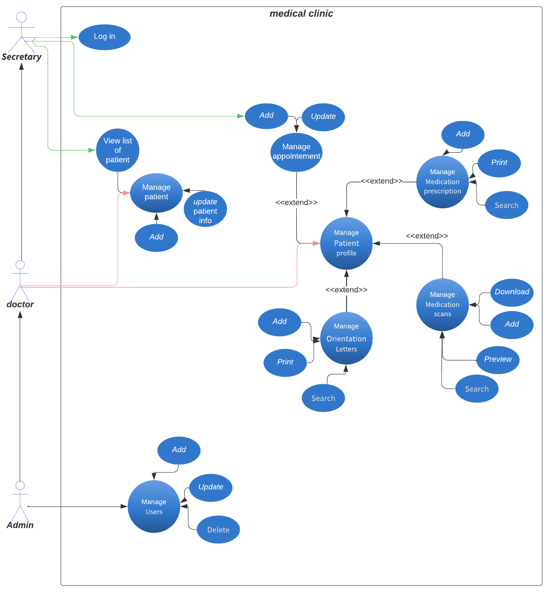

## About laravel-medical:

laravel-medical is a full-stack web application that allows the user to manage a medical clinic.
  

-   There are three roles in this app, each with a particular level of access:
 

    -   **SECRETARY** can:
        1. Login
        2. Create a new appointment
        3. View list of the patients and the doctors in registered in the app.
    -   **DOCTOR** can:
        1. Do anything a secretary can do.
        2. Manage the patient assigned to him (_has/had appointment with them_).
        3. Manage the patient's profile (_see the use case diagram_).
    -   **ADMIN** can:
        1. Do anything a doctor & secretary can do.
        2. manage users of the app.

## Tech used:

-   Laravel V9 : web application framework
-   AdminLTE Bootstrap Admin Dashboard Template [link](https://adminlte.io/themes/v3/)

## Use Case Diagram:

